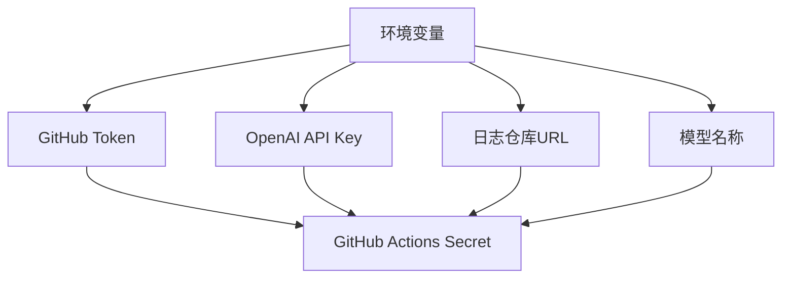

### 代码评审报告

#### 1. GitHub Actions 工作流变更评审 (`main-maven-jar.yml`)

**变更内容：**
```diff
+        env:
+          GITHUB_TOKEN: ${{ secrets.CODE_TOKEN }}
```

**评审意见：**
- ✅ **优点：** 通过环境变量注入 GitHub Token，避免了硬编码敏感信息，符合安全最佳实践
- ⚠️ **建议：** 
  - 确保仓库的 `CODE_TOKEN` secret 已正确配置且具有足够权限（至少需要 `repo` 和 `workflow` 权限）
  - 考虑在 token 名称前加前缀（如 `OPENAI_CODE_REVIEW_TOKEN`）提高可读性
  - 建议添加 token 权限最小化原则说明（如仅需要 `contents: write` 权限）

---

#### 2. OpenAI 代码评审 SDK 变更评审 (`OpenAiCodeReview.java`)

**总体变更分析：**
主要新增了 GitHub 日志写入功能，并重构了部分代码逻辑。以下是详细评审：

##### 2.1 主方法变更 (`main`)
```java
+        String githubToken = System.getenv("GITHUB_TOKEN");
+        if (githubToken == null || githubToken.isEmpty()) {
+            throw new IllegalArgumentException("GITHUB_TOKEN环境变量未设置");
+        }
```
- ✅ **优点：** 添加了环境变量校验，提高健壮性
- ⚠️ **问题：** 移除了空代码差异检查逻辑（原代码在 `code` 为空时直接返回）
- 🔧 **建议：** 恢复空差异检查，避免无效 API 调用：
  ```java
  if (diffCode.toString().trim().isEmpty()) {
      System.out.println("没有代码变更，无需评审");
      return;
  }
  ```

##### 2.2 API 调用优化 (`codeReview`)
```java
+        // 增加超时时间到5分钟
         OkHttpClient client = new OkHttpClient.Builder()
-                .connectTimeout(3, TimeUnit.MINUTES)
-                .writeTimeout(3, TimeUnit.MINUTES)
-                .readTimeout(3, TimeUnit.MINUTES)
+                .connectTimeout(5, TimeUnit.MINUTES)
+                .writeTimeout(5, TimeUnit.MINUTES)
+                .readTimeout(5, TimeUnit.MINUTES)
```
- ✅ **优点：** 增加超时时间提升大文件处理稳定性
- ⚠️ **问题：** 硬编码 API Key 存在安全风险：
  ```java
  String apiKey = "655c244927a04b70b3e852685f808e76.lY208DcifC1UpPAe";
  ```
- 🔧 **建议：** 
  - 通过环境变量注入 API Key：
    ```java
    String apiKey = System.getenv("OPENAI_API_KEY");
    if (apiKey == null || apiKey.isEmpty()) {
        throw new IllegalArgumentException("OPENAI_API_KEY环境变量未设置");
    }
    ```
  - 在 GitHub Actions 中添加对应 secret

##### 2.3 新增日志写入功能 (`writeLog`)
```java
+    private static String writeLog(String token, String log) throws GitAPIException, IOException {
+        Git git = Git.cloneRepository()
+                .setURI("https://github.com/ChanYanny/openai-code-review-log.git")
+                .setDirectory(new File("repo"))
+                .setCredentialsProvider(new UsernamePasswordCredentialsProvider(token, ""))
+                .call();
```
- ✅ **优点：** 实现了评审结果持久化，便于追溯
- ⚠️ **问题：**
  1. **硬编码仓库地址**：缺乏灵活性
  2. **资源泄漏风险**：未关闭 Git 对象
  3. **并发安全问题**：多实例同时运行可能导致仓库冲突
  4. **目录创建缺陷**：`dateFolder.mkdirs()` 可能失败但未处理
- 🔧 **建议改进：**
  ```java
  // 1. 通过环境变量配置仓库地址
  String repoUrl = System.getenv().getOrDefault("LOG_REPO_URL", 
      "https://github.com/ChanYanny/openai-code-review-log.git");
  
  // 2. 使用 try-with-resources 确保资源释放
  try (Git git = Git.cloneRepository()
          .setURI(repoUrl)
          .setDirectory(new File("repo"))
          .setCredentialsProvider(new UsernamePasswordCredentialsProvider(token, ""))
          .call()) {
      
      // 3. 添加目录创建检查
      File dateFolder = new File("repo/" + dateFolderName);
      if (!dateFolder.exists() && !dateFolder.mkdirs()) {
          throw new IOException("无法创建目录: " + dateFolder.getAbsolutePath());
      }
      
      // ... 其余代码
  }
  
  // 4. 添加文件名冲突处理（可选）
  String fileName = generateRandomString(12) + ".md";
  File newFile = new File(dateFolder, fileName);
  while (newFile.exists()) { // 防止文件名冲突
      fileName = generateRandomString(12) + ".md";
      newFile = new File(dateFolder, fileName);
  }
  ```

##### 2.4 随机字符串生成 (`generateRandomString`)
```java
+    private static String generateRandomString(int length) {
+        String characters = "ABCDEFGHIJKLMNOPQRSTUVWXYZabcdefghijklmnopqrstuvwxyz0123456789";
+        Random random = new Random();
+        // ...
+    }
```
- ⚠️ **问题：** 使用 `Random` 存在可预测性风险
- 🔧 **建议：** 改用 `SecureRandom` 提高安全性：
  ```java
  import java.security.SecureRandom;
  
  private static String generateRandomString(int length) {
      String characters = "ABCDEFGHIJKLMNOPQRSTUVWXYZabcdefghijklmnopqrstuvwxyz0123456789";
      SecureRandom random = new SecureRandom();
      // ...
  }
  ```

---

### 3. 架构性建议

#### 3.1 配置管理优化


**建议：**
1. 统一通过环境变量管理所有配置
2. 在 GitHub Actions 中集中管理 secrets
3. 添加配置校验机制（如 `ConfigValidator` 类）

#### 3.2 错误处理增强
```java
public class OpenAiCodeReview {
    public static void main(String[] args) {
        try {
            // 主逻辑
        } catch (IllegalArgumentException e) {
            System.err.println("配置错误: " + e.getMessage());
            System.exit(1);
        } catch (GitAPIException e) {
            System.err.println("Git操作失败: " + e.getMessage());
            System.exit(2);
        } catch (IOException e) {
            System.err.println("IO错误: " + e.getMessage());
            System.exit(3);
        } catch (Exception e) {
            System.err.println("未知错误: " + e.getMessage());
            e.printStackTrace();
            System.exit(4);
        }
    }
}
```

#### 3.3 并发处理方案
```java
// 使用文件锁防止并发冲突
private static String writeLog(String token, String log) throws Exception {
    File lockFile = new File("repo/.lock");
    try (RandomAccessFile raf = new RandomAccessFile(lockFile, "rw");
         FileChannel channel = raf.getChannel();
         FileLock lock = channel.tryLock()) {
        
        if (lock == null) {
            throw new IOException("无法获取文件锁，可能有其他实例正在运行");
        }
        
        // 执行Git操作...
    }
}
```

---

### 4. 安全性建议

1. **敏感信息保护**：
   - 🔒 所有密钥必须通过环境变量注入
   - 🛡️ 添加密钥格式校验（如 GitHub Token 需以 `ghp_` 开头）
   - 📜 在文档中明确说明所需权限范围

2. **输入验证**：
   ```java
   // 添加代码差异大小限制
   if (diffCode.length() > 100_000) { // 100KB
       throw new IllegalArgumentException("代码差异过大，超过限制");
   }
   ```

3. **输出清理**：
   ```java
   // 防止日志中包含敏感信息
   private static String sanitizeLog(String rawLog) {
       return rawLog.replaceAll("(ghp_|gho_|ghu_|ghs_|ghr_)[A-Za-z0-9_]{36}", "[REDACTED]");
   }
   ```

---

### 5. 性能优化建议

1. **Git 操作优化**：
   ```java
   // 使用浅克隆减少数据传输
   Git.cloneRepository()
       .setURI(repoUrl)
       .setDirectory(new File("repo"))
       .setDepth(1) // 只克隆最新提交
       .setNoTags(true)
       .call();
   ```

2. **API 调用优化**：
   ```java
   // 添加请求压缩
   RequestBody requestBody = RequestBody.create(
       MediaType.parse("application/json; charset=utf-8"),
       jsonInputString
   );
   
   Request request = new Request.Builder()
       .url(url)
       .post(requestBody)
       .addHeader("Accept-Encoding", "gzip")
       .build();
   ```

---

### 6. 测试建议

1. **单元测试覆盖**：
   - `generateRandomString()`：验证长度和字符集
   - `writeLog()`：模拟 Git 操作（使用内存文件系统）
   - `codeReview()`：Mock HTTP 响应

2. **集成测试**：
   ```java
   @Test
   void testFullWorkflow() throws Exception {
       // 准备测试仓库
       String testRepoUrl = createTempRepo();
       
       // 设置环境变量
       setEnv("GITHUB_TOKEN", TEST_TOKEN);
       setEnv("OPENAI_API_KEY", TEST_API_KEY);
       setEnv("LOG_REPO_URL", testRepoUrl);
       
       // 执行主流程
       OpenAiCodeReview.main(new String[0]);
       
       // 验证结果
       assertTrue(logFileExists(testRepoUrl));
   }
   ```

---

### 总结

本次变更实现了代码评审日志的持久化功能，显著提升了工具的实用性。但在**安全性**（硬编码密钥）、**健壮性**（错误处理缺失）和**可维护性**（硬编码配置）方面存在改进空间。

**优先级改进建议：**
1. 🔴 **立即修复**：移除硬编码的 API Key
2. 🟡 **近期优化**：完善错误处理和资源管理
3. 🟢 **长期规划**：实现配置外部化和并发控制

通过实施上述建议，可将该工具提升为生产级就绪的代码评审解决方案。